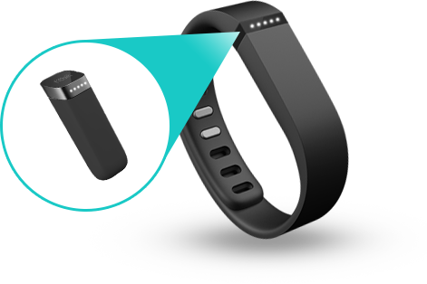
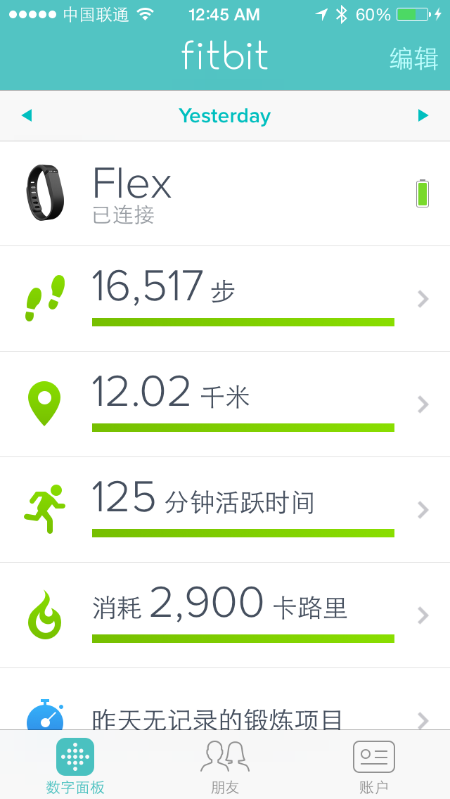

After coming to Shenzhen, my body weight has been increasing continuously. From about 60 kilograms to overweight now, and my body is getting more and more fat. And now, I had high blood pressure and moderate fatty liver, so weight loss is inevitable. In order to measure the amount of daily exercise more scientifically, I bought the fibit flex

## Appearance

fitbit flex has a very ordinary appearance, it just looks like an ordinary plastic band

The band has two parts, the outer band shell and the inner host. There are two band shells, one large and one small. You can choose according to your wrist size.

You need to take out the host and connect it to a dedicated charger when charging. The battery life is about 5 to 7 days. If you register and bind a Fitbit account, when the battery is almost out of power, Fitbit will send an email to notify you of charging. , This point seems more intimate, but what makes me puzzled is why I don’t remind me directly in the fitbit app, and the email notification is not very accurate. There are several times when I have no battery, I have not received any email to notify me.

The band shell is made of relatively soft plastic material, which is very comfortable to wear, but the plastic material is easier to scratch and stick to stains. The design of the band buckle is not very easy to use. It is difficult to use the first few times. It takes a lot of effort to buckle. After a few times of use, the buttonhole will loosen, which makes it easier to use. I don’t know if the buckle will not be tight after a long time. The whole band is waterproof, but it is estimated that you can only wear it when you take a bath and wash your face. Soaking it in water for a long time will not work.

## Function

The function is very simple. It mainly records the number of steps walked per day and the time of sleep per day, and calculates the approximate calories consumed per day based on the number of steps walked per day. Before going to sleep, you need to tap the band for a few seconds to enter the sleep recording mode. After waking up, you need to tap the bracelet for a few seconds to end the sleep recording mode. The band will automatically record the time to sleep, the number of waking up and the time when you wake up. I feel pretty accurate.

The diet record needs to be manually recorded in the app every day. There are many items in the diet record that can be selected and can be customized, but this is still not as good as Jawbone's photo record.

you can customize your own weight loss plan, calculate how much exercise you need every day based on your current weight and goal, and calculate the time required to reach your goal based on the exercise intensity. Every day will be reminded to complete the exercise plan for the day.

## APP

The app is an important carrier of the smart band. Fitbit flex's app is quite satisfactory. It mainly records and displays the data of the band. When the account is bound to the app, the data of the band can be synchronized at any time on the mobile phone.

