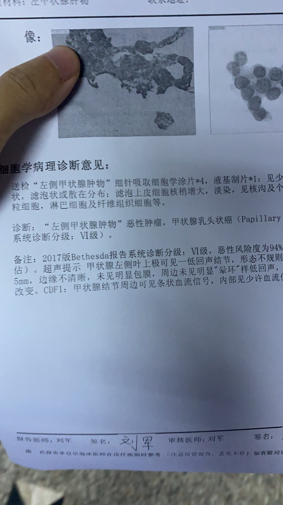
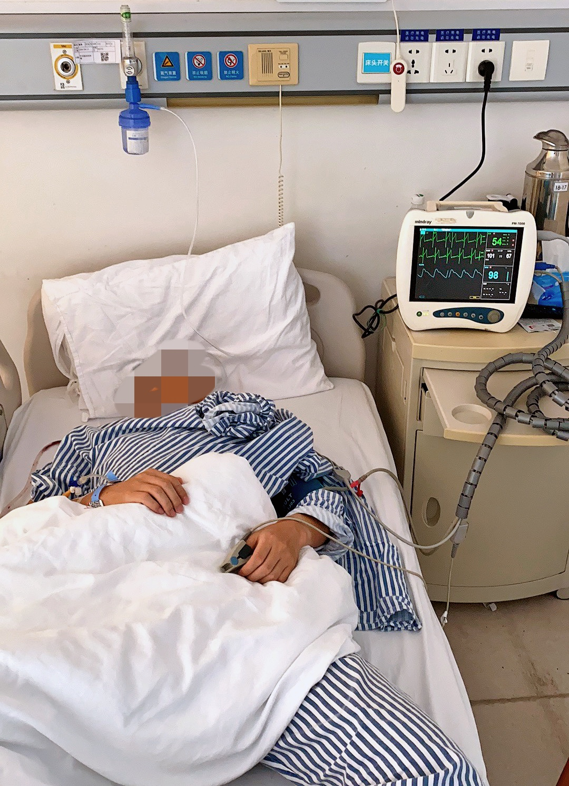

一个多月前(2020年6月)公司组织年度例行体检，和往年一样总会有一些小毛病，我也没太放在心上。但是今年有点不一样，在做彩超的时候小姐姐告诉我有甲状腺结节，以前体检都没有发现过。

一周后体检报告出来，结节是良性的，不需要处理，定期去医院复查就可以。当时心想又多了一个小毛病，应该没多大问题，但是为了保险起见我还是决定去医院复查一次。到医院，体检报告给医生看过以后，医生建议我三个月后回来复查就可以，但当时还是有一点点担忧，要求马上复查一次。

## 确诊

第二天彩超，这次医院做彩超的小姐姐认真多了，来来回回照了很多次，小姐姐后来表情和语气有些凝重了，有肿瘤，边缘不规则，体积 6x5x5mm，当天转超声介入，预约三天后做穿刺。到这时感觉有点严重了，一般来说良性的话彩超就能观察出来，如果需要穿刺的话大半估计是恶性的了。

三天后穿刺没有想象中的那么痛苦，打完麻药后，从喉咙穿针进去，然后取肿瘤中的组织细胞，全程不会感觉到疼痛，但是针在喉咙里剐细胞的那种感觉会让人很不舒服，那种剐东西的声音会让人有点头痛。做完穿刺当天挂号甲乳外科，看三天后的结果。

三天后结果出来果然是恶性，甲状腺人体乳头状癌，万幸的是发现得很及时，还处在非常早期，未转移到淋巴。医生建议手术切除一半的甲状腺，以免进一步恶化转移。

但医院床位紧张，需要等待一到两周，留下了电话号码后，边上班边等医院给我打电话，一周多以后医院还是没有给我打电话，打电话到医院询问进程，一直联系不到医生。开始有些焦急，挂了另外一家医院的号，这家医院安排了第二天住院，下周手术。

## 手术

住院前几天除了做了一些常规的术前检查，其他时间和平常一样活蹦乱跳，还抽空爬了医院旁边的一座小山。手术前一天医生会进行术前谈话，告知手术方案、手术风险、特殊费用之类的，然后签风险告知书。手术前一晚10点钟以后不能进食进水，护士也会在手术提前一天通知注意事项。

手术当天，我是安排的当天第一台手术，7点半的时候护士就把我们带到了手术楼层，在进入手术室之前做了一些身份信息的确认，然后坐上轮椅，推到手术室门口前等待。等了大概十几分钟，推进了手术室，脱掉上衣，换上手术服，头向后仰平躺在手术台上。麻醉师又做了一次确认，插入针管，带上氧气面罩，麻醉师轻轻的说开始睡觉咯，麻醉师开始向针管推入麻醉药剂，不到十秒钟的时间我就渐渐失去知觉。

醒来的时候我模模糊糊听到有人喊我的名字，让我确认我叫什么名字，当时神智不清，艰难的说了自己的名字，感觉是有人围着把我往病房推。当我意识稍微清醒一点的时候我已经躺在病床上了，想着要发消息报平安，当时就拿手机乱按了一通，然后又睡着了。

## 术后恢复

手术第一天由于麻醉的影响，会昏昏沉沉，甚至有些头痛，吞咽会有些困难，医院会打一些葡萄糖点滴，手术6小时以后才能吃一些流食，喝一点水，没办法下床（要提前准备好尿壶）。

第二天麻醉完全散去，这时候吞咽就会明显感觉到喉咙痛，每次吞咽唾液都很困难，吃东西也只能吃一些软的东西，稀饭、香蕉、葡萄之类的。这时可以自己下床上厕所，自己活动下。

第三天喉咙会稍微好一点，吞咽不再那么困难，可以吃点饭。

第四、第五天的时候恢复得差不多了，这时候已经可以正常饮食，吞咽不再疼痛，只是会有一些异物感，但是咳嗽、打喷嚏的时候还是要注意。医院也会安排拔掉导流管，准备出院。
